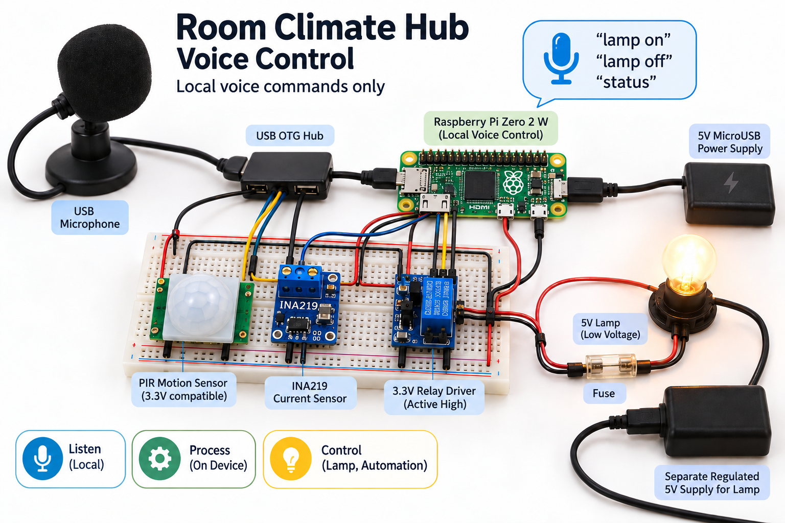
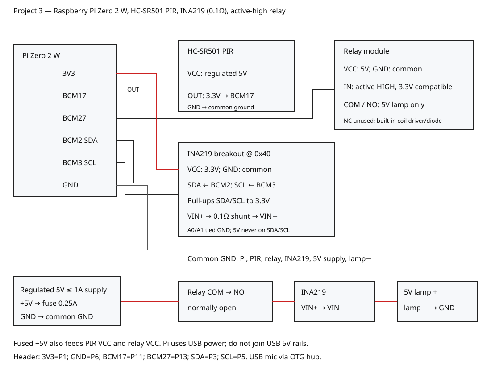

# Room Climate Hub Voice Control

Roadmap **3**: Raspberry Pi Zero 2 W accepts local spoken `lamp on`, `lamp off` and `status` commands using Vosk, operates a low-voltage relay driver, reads INA219 current and reports PIR motion. No cloud recognition, MQTT or remote command endpoint is used. Despite the roadmap family name, this BOM contains no temperature sensor; climate measurement is not claimed.



This generated illustration is conceptual. Use the exact pin map and editable SVG below for assembly.

## Objectives and features

Local speech recognition with a limited grammar; explicit lamp commands; current telemetry; PIR motion telemetry; fail-off on invalid current, INA219 reset/overflow or absolute current above 300 mA; no automatic re-enable after recovery. Unknown speech is rejected. PIR is telemetry only, not a safety authorization mechanism.

## Architecture and platform

USB microphone → 16 kHz mono PCM → local Vosk model → exact command policy → BCM27 relay driver → fused 5 V LED lamp. INA219 provides shunt current over I²C; PIR signal is read on BCM17. The Pi needs no network during operation after installing packages/model. The USB microphone and OTG hub are explicit voice-input prerequisites absent from the three core roadmap component names; software simulation can run without them. No extra climate sensor is invented.

## BOM quantities

| Item | Qty | Variant |
| --- | ---: | --- |
| Raspberry Pi Zero 2 W | 1 | Fitted 40-pin header, Raspberry Pi OS |
| PIR module | 1 | 5 V powered, output verified ≤3.3 V, e.g. suitable HC-SR501 |
| Relay driver module | 1 | Active-high 3.3 V input, 5 V coil supply, driver/flyback protection |
| INA219 breakout | 1 | I²C 0x40, 0.1 Ω shunt, 3.3 V logic |
| Low-voltage 5 V LED lamp | 1 | Rated ≤200 mA, not a bare unregulated LED |
| External regulated 5 V supply | 1 | Fused; never connect its positive rail to Pi GPIO/header |
| Appropriate lamp fuse | 1 | 0.25 A fuse for the specified ≤200 mA lamp; software threshold is not a fuse |
| USB microphone + OTG hub | 1 each | Voice input and Pi data connector |
| Pi microSD, regulated USB power, jumpers | 1 set | No mains breadboard wiring |

## Prerequisites

Raspberry Pi OS with Python 3, GPIO header, I²C enabled, PortAudio/ALSA microphone support and a compatible local Vosk model. The model's own license applies separately; choose the English small model appropriate to your installation and verify its provenance from the [official model catalog](https://alphacephei.com/vosk/models). Package dependencies are pinned in [requirements.txt](requirements.txt). Zero 2 W resource limits may cause dropped audio; this implementation does not claim measured speech accuracy or latency.

## Exact pin map and circuit/wiring



| Pi physical pin / BCM | Connection |
| --- | --- |
| Pin 1 / 3V3 | INA219 VCC |
| Pin 6 / GND | INA219 GND, PIR GND, relay GND, external supply negative, lamp negative |
| Pin 3 / BCM2 SDA1 | INA219 SDA |
| Pin 5 / BCM3 SCL1 | INA219 SCL |
| Pin 11 / BCM17 | PIR OUT; must be ≤3.3 V |
| Pin 13 / BCM27 | Relay IN; active high 3.3 V compatible |
| External fused +5 V | PIR VCC, relay VCC and relay COM |
| Relay NO | INA219 VIN+ |
| INA219 VIN− | Lamp + |
| Lamp − | External supply negative / common GND |
| Pi PWR USB | Separate Pi regulated USB power |
| Pi USB data | OTG hub → USB microphone |

Leave relay NC disconnected. External +5 V never goes to Pi GPIO or INA219 logic VCC. INA219 senses the lamp branch only, not PIR/relay/Pi consumption. The 0.1 Ω shunt with calibration 4096 gives 0.1 mA per current-register count. Digital I²C pull-ups must go to 3.3 V. Use a relay module with an actual driver transistor and flyback protection; a bare coil cannot be driven by GPIO.

## Assembly

Disconnect both supplies. Wire grounds and 3.3 V sensor logic, I²C, PIR signal and relay input. Build the fused 5 V lamp series path in the table, double-check VIN+/VIN− orientation and keep NC insulated. Confirm voltage ratings with module datasheets and a meter before attaching the Pi. Power the external load and Pi using separate appropriate supplies with only their negative/common ground joined. Warm-up behavior of the PIR is module-dependent and not used as an authorization interlock.

## Setup, installation and configuration

```sh
sudo raspi-config  # Enable I2C under Interface Options.
sudo apt-get install python3-venv python3-lgpio libportaudio2
python3 -m venv --system-site-packages .venv
. .venv/bin/activate
pip install -r requirements.txt
python -m sounddevice  # Identify the USB microphone name.
```

Download and unpack a compatible Vosk model from the official catalog into ignored `models/`; models are not bundled or silently downloaded by runtime. Reboot if needed for I²C. Ensure your account has GPIO/I²C permissions. `src/hardware.py` fixes BCM17/27, bus 1 and INA219 0x40; `src/controller.py` fixes 300 mA threshold. Edit pins/code/SVG together if hardware differs.

## Flashing and usage

This is a Pi Python application; there is no microcontroller flashing step. Copy/install the repository on the Pi and run it from its root:

```sh
python -m src.main --simulate 'lamp on' status 'lamp off'
python -m src.main --model models/your-unpacked-vosk-model --device 'YOUR_USB_MIC_DEVICE_NAME'
```

Speak exactly `lamp on`, `lamp off` or `status`. Recognition is completely local. Stop with Ctrl+C; cleanup turns the relay off. Physical current is polled as audio blocks arrive or queue timeouts occur, approximately every 100 ms under normal operation. Recognition can mishear words; do not attach hazardous loads. This is best-effort software fault-off, not a safety-rated emergency stop. A physical fuse is mandatory.

## Telemetry/data formats and expected output

JSON lines to stdout: project_id=3; relay_on boolean; motion boolean; current_ma signed mA or null when invalid; fault boolean; command_accepted boolean on command responses. Negative current means reversed shunt polarity and the absolute value is still limited. The [sample](sample-data/example.json) is synthetic. Simulation prints relay on/current 80 mA, status unchanged, then relay off/current 0 mA; it does not exercise a microphone or electrical circuit. Do not treat simulated values as physical measurements.

## Actual run tests and validation

```sh
python -m unittest discover -s tests -v
python -m compileall -q src tools tests
python -m src.main --simulate 'lamp on' status 'lamp off'
python tools/validate.py
python tools/validate_completion.py
```

Tests exercise command acceptance, unknown commands, overcurrent fault-off, invalid samples, explicit recovery and cleanup, plus INA219 signed conversion/calibration/overflow/endian behavior with mocked I²C. CI also checks generated PNG integrity, editable SVG, documentation links, license and credential patterns. Representative validation is Python compilation/simulation on a cloud host, not a Pi hardware test. See [actual results](docs/validation-results.md). No physical lamp, GPIO, microphone, recognition accuracy or electrical test is claimed.

## Troubleshooting

I²C error: enable bus 1, verify 0x40 and 3.3 V wiring. Fault persists: check INA219 calibration/shunt and current; fix wiring, then issue a new lamp-on command after valid readings. Relay inverted: use the required active-high driver, do not silently reverse logic without reviewing startup safety. No audio: select the correct device and 16 kHz-capable input; check ALSA and PortAudio. Vosk import/model failures: use a compatible OS/wheel/model, inspect official install guidance. Audio overflow: close other applications, reduce logging or use faster hardware; model performance on Zero 2 W is unmeasured. False speech activation: retain exact grammar and disconnect the lamp while testing speech in background noise.

## Limitations and domain safety

No speaker feedback, remote control, wake-word authentication, hard-real-time interlock or persistent state. GPIO cleanup cannot protect against every process/power/hardware failure. Current polling depends on process scheduling; the fuse and driver protection remain necessary. Do not wire mains, heaters, locks, medical equipment or machinery. Current threshold applies only to this small lamp; using another load requires electrical redesign and independent testing. Voice recognition is not identity verification.

## Future work

Separate bounded sensor-poll thread with watchdog, recognition accuracy/latency measurements on target, audio prompts, explicit arming confirmation and signed hardware configuration. Preserve local recognition and truthful test evidence.

## Contributing and license

Open a PR with policy/adapter tests and consistent code, wiring and SVG. Include sanitized diagnostics and identify simulation versus physical tests. Original code is [MIT](LICENSE); external libraries/models retain their own licenses.

## Primary references

[Raspberry Pi documentation](https://www.raspberrypi.com/documentation/computers/raspberry-pi.html), [Vosk installation](https://alphacephei.com/vosk/install), [INA219 datasheet](https://www.ti.com/lit/ds/symlink/ina219.pdf).
